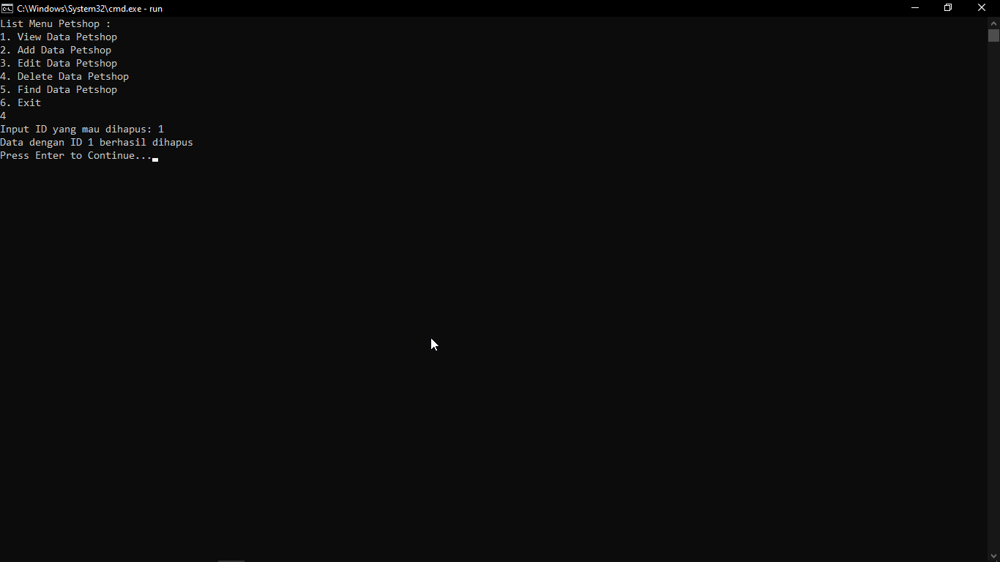

# Janji
*Saya Putra Hadiyanto Nugroho dengan NIM 2308163 mengerjakan soal Latihan Modul 1 dan Tugas Praktikum 1 dalam mata kuliah Desain Pemrograman Berbasis Objek untuk keberkahanNya maka saya tidak melakukan kecurangan seperti yang telah dispesifikasikan. Aamiin.*

# Desain Program
Program terdiri dari 1 class yaitu **Petshop**
Di dalam class **Petshop** terdapat variabel:
1. ID
2. Nama
3. Kategori
4. Harga
5. Foto (Khusus PHP)

# Dokumentasi dan Penjelasan
Untuk C++, Java, dan Python tampilan sama persis dan hanya beda sedikit di bagian print tabel. Di dalam program terdapat beberapa command yang user dapat memilih di awal jalannya program :
1. View Data (SHOW)
2. Tambah Data (ADD)
3. Edit Data (EDIT)
4. Hapus Data (DELETE)
5. Cari Data (FIND)
6. Exit

Pemilihan opsi menggunakan inputan angka yang diketik oleh user di awal jalannya program. Program tidak akan berhenti sampai user menginput angka 6 (exit). Terdapat beberapa catatan untuk berapa opsi, yaitu : 
1. Pada saat Edit Data, Hapus Data, dan Cari Data, kita harus memberi ID yang mana yang ingin diedit/dihapus/dicari. Jika ID tidak ditemukan maka akan muncul error "ID tidak ditemukan"
2. Jika kita memilih Edit Data, maka terdapat beberapa opsi untuk mengganti atribut satu per satu atau langsung seluruh atribut.

## Dokumentasi PHP
Program PHP ditampilkan dengan program web simple menggunakan HTML dan CSS. Data yang ditampilkan di homepage berupa tabel berisi list Petshop. Untuk menambah data baru, hanya perlu menekan tombol add dan isi data baru. Untuk edit dan hapus berada di sebelah kanan dari data per Petshop. Data ini disimpan melalui sebuah array dan menggunakan session sehingga tidak akan hilang dalam beberapa waktu saja.

# Dokumentasi Foto
## C++

    
    
    
    

    
    
    
    

## Java

    
    

## Python

    
    

## PHP

    
    

